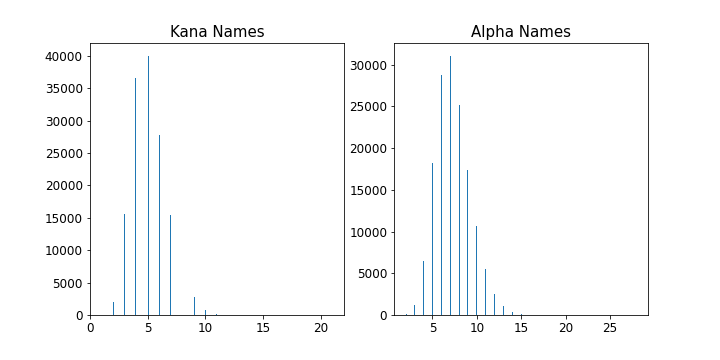
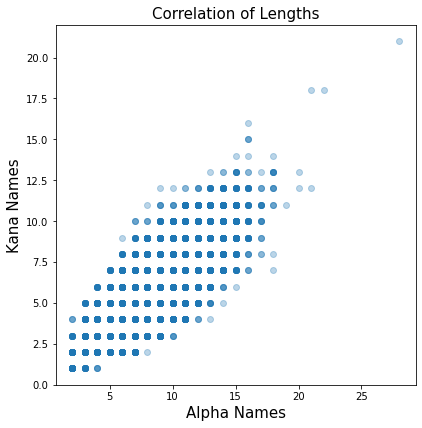
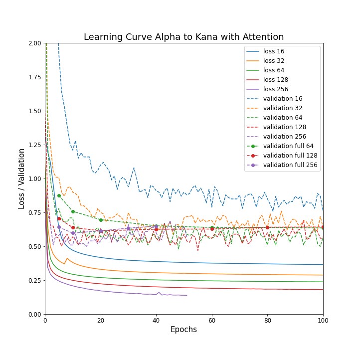
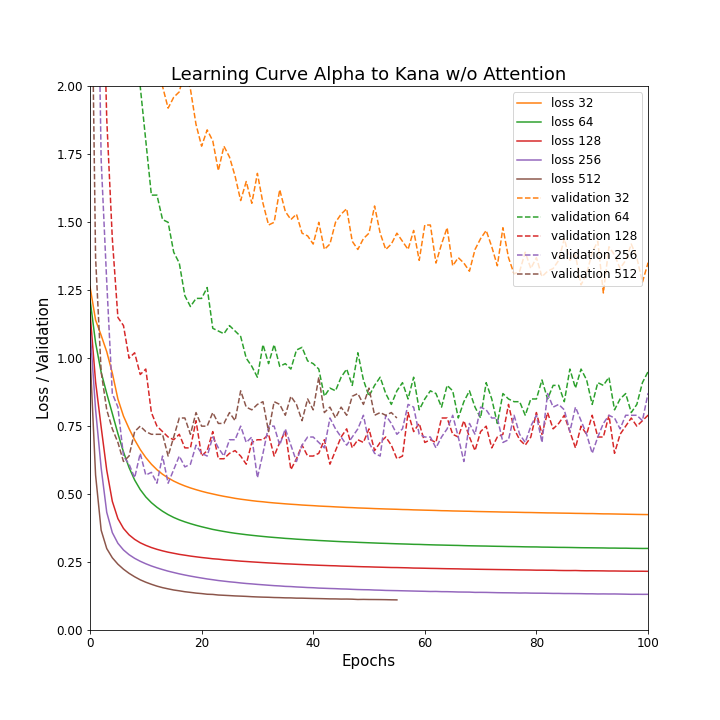
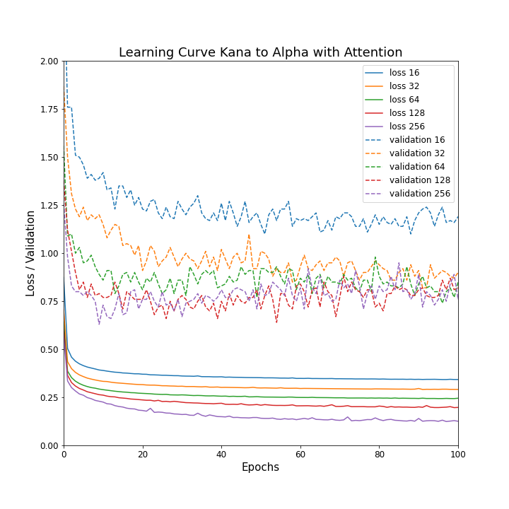
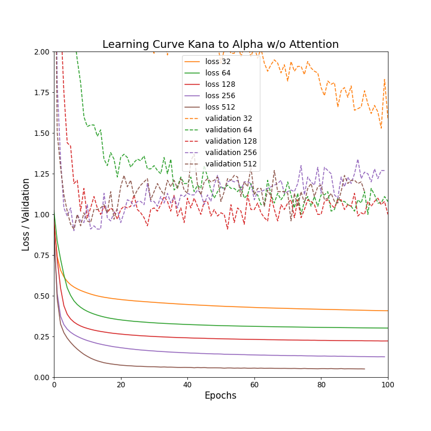

# Alphabets-Kana Person Names Transliterators

Person Names Transliterators between Latin-based Names and Japanese Kana using Seq2Seq with Attention

(機械学習を用いたアルファベットとカナの間の外国人名変換)

# Highlights

* Both directions: alphabets-to-Kana and Kana-to-alphabets

* GRU encoder & GRU decoder with or w/o Attention in Tensorflow 2.3

* Trained with over 100K trained data (80% Train / 10% Valid / 10% Test)

* NBest with a Stack decoder

* One trained model for each direction included

* Training process provided in Jupyter notebook.

* Inference (prediction) tool in provided in python.


## A sample transliteration from Alphabets to Kana
```
Input: <mcdonald>
Predicted translatons with probability (Nbest):
[0.1748] <マクドナルド>
[0.1044] <マクダナルド>
[0.0557] <マックドナルド>
[0.0546] <マクダノルド>
[0.0400] <マクダナード>
```

## A sample transliteration from Kana to Alphabets
```
Input: <ベルリッツ>
Predicted translatons with probability (Nbest):
[0.6968] <berlitz>
[0.0920] <berliz>
[0.0483] <berlich>
[0.0301] <berlichs>
[0.0209] <werlitz>
[0.0179] <bellitz>
[0.0100] <bellritz>
[0.0078] <belritz>
[0.0072] <berlichsz>
```

# Transliterators Usage:
It comes with one trained model for each direction, which work pretty good.
The transliterators are provided in a command-line tool [inference.py](inference.py) written in python.
The Japanese Katakana is supported. For the western alphabets, most of the common letters with accents are supported.
Please see [utils/character_converters.py](utils/character_converters.py) for details.

```
usage: inference.py [-h] [--infile [INFILE]] [--outfile [OUTFILE]]
                    [--model_path_prefix [MODEL_PATH_PREFIX]]
                    [--tokenizer_dir [TOKENIZER_DIR]] [--use_attention]
                    [--do_not_use_attention] [--num_units [NUM_UNITS]]
                    [--beam_width [BEAM_WIDTH]] [--nbest [NBEST]] [--alpha_to_kana]
                    [--kana_to_alpha]

transliterates western person names in Latin-based alphabets into Japanese Kana

optional arguments:
  -h, --help            show this help message and exit
  --infile [INFILE], -i [INFILE]
                        file that contains list of input names
  --outfile [OUTFILE], -o [OUTFILE]
                        output file
  --model_path_prefix [MODEL_PATH_PREFIX], -m [MODEL_PATH_PREFIX]
                        path to the model data file without extension
  --tokenizer_dir [TOKENIZER_DIR], -t [TOKENIZER_DIR]
                        directory that contains the tokenizer files in json.
                        The names for the tokenizers
                        are{alphas/kanas_tokenizer.json
  --use_attention, -pa  set this flag if the model's decoder uses attention
  --do_not_use_attention, -na
                        set this flag if the model's decoder does not use
                        attention. If nether -pa or -na is set, inferred from
                        the model path prefix.
  --num_units [NUM_UNITS], -u [NUM_UNITS]
                        nuber of hidden units the model has. If not set it,
                        inferred from the model path prefix.
  --beam_width [BEAM_WIDTH], -b [BEAM_WIDTH]
                        beam width used for stack decoding
  --nbest [NBEST], -n [NBEST]
                        number of candidates (nbest) to predict per input name
  --alpha_to_kana, -a2k
                        convert alphabets into kana
  --kana_to_alpha, -k2a
                        convert kana to alphabets. If neither a2k or k2a is
                        set, inferred from the model path prefix.
```

Sample: The following is a sample command line to convert a list of names in alphabets in
    [samples_in/alpha_names_01.txt](samples_in/alpha_names_01.txt)
with the specified model with attention
    [training_output/alpha_to_kana_64/ckpt-100.data-00000-of-00001](training_output/alpha_to_kana_64/ckpt-100.data-00000-of-00001)
into list of predicted names in Kana in
    [samples_out/alpha_converted_01.txt](samples_out/alpha_converted_01.txt)


```
$ python inference.py -i samples_in/alpha_names_01.txt -o samples_out/alpha_converted_01.txt -m traning_output/alpha_to_kana_64/ckpt-100
```

# Training

## Data Analysis, Cleaning, and Preparation
The labeled data obtained by scraped over Internet are first cleaned using the Notebook:
[clean_labeled_data.ipynb](clean_labeled_data.ipynb).
It also replaced some accented alphabets to an alphabet of sequence of alphabets to reduce
the dimension of the encoder. 

    Ex.) 'ö' => 'oe'

Please see [utils/character_converters.py](utils/character_converters.py) for the conversion details.

After cleaning, some brief analysis was made with [prepare_training_validation_sets.ipynb](prepare_training_validation_sets.ipynb)
The following 3 graphs show the distriution of the lenghts and their correlations.
Based on this observation, the data whose alphabets is longer than 16 or whose kana is longer than 12 were further removed from the labeled data.
The labeled data are split into three sets:

    training: 118,642 pairs (90%)
    validation: 14,830 pairs (10%)
    test: 14,830 pairs (10%).

<a href="figs/hist_lens.png"> </a>

<a href="figs/data_corr.png"> </a>

## Training and Hyper Parameter Tuning
For each direction, two types of model are arranged:

    GRU encoder -> BahranauAttention & GRU decoder
    GRU encoder -> GRU decoder

The decoder training is done by the incremental teacher forcing. The hyper parameter is the number of hidden units for the GRU units.
The following 4 charts show the learning curves.

<a href="figs/learning_curve_alpha_to_kana.png"> </a>
<a href="figs/learning_curve_alpha_to_kana_wo_attn.png"> </a>

<a href="figs/learning_curve_kana_to_alpha.png"> </a>
<a href="figs/learning_curve_kana_to_alpha_wo_attn.png"> </a>

* In both directions the models with attention gives better performance.
* For alpha-to-kana with attention, the model starts to overfit around 128 units.
* For kana-to-alph with attention, the model starts to overfit around 64 units.

Please see the following for the training details. I used Anaconda with Jupyter Notebook.

* [train_alpha_to_kana.ipynb](train_alpha_to_kana.ipynb)
* [train_alpha_to_kana_wo_attn.ipynb](train_alpha_to_kana_wo_attn.ipynb)
* [train_kana_to_alpha.ipynb](train_kana_to_alpha.ipynb)
* [train_kana_to_alpha_wo_attn.ipynb](train_kana_to_alpha_wo_attn.ipynb)


# Requirements

The training requires labeld data, which is not included here.

It was trained with Tensorflow 2.2.0.

It uses my stack decoder [TFStackDecoder](https://github.com/ShoYamanishi/TFStackDecoder), and 
[Red-Black Tree](https://github.com/ShoYamanishi/RedBlackTree) with Python 3.7.7.

# License
Copyright (c) 2020 Shoichiro Yamanishi
PersonNamesTransliterator is released under Apache license 2.0.

# Contact
For commercial and technical inquiries, please contact: Shoichiro Yamanishi

    yamanishi72 at gmail dot com

